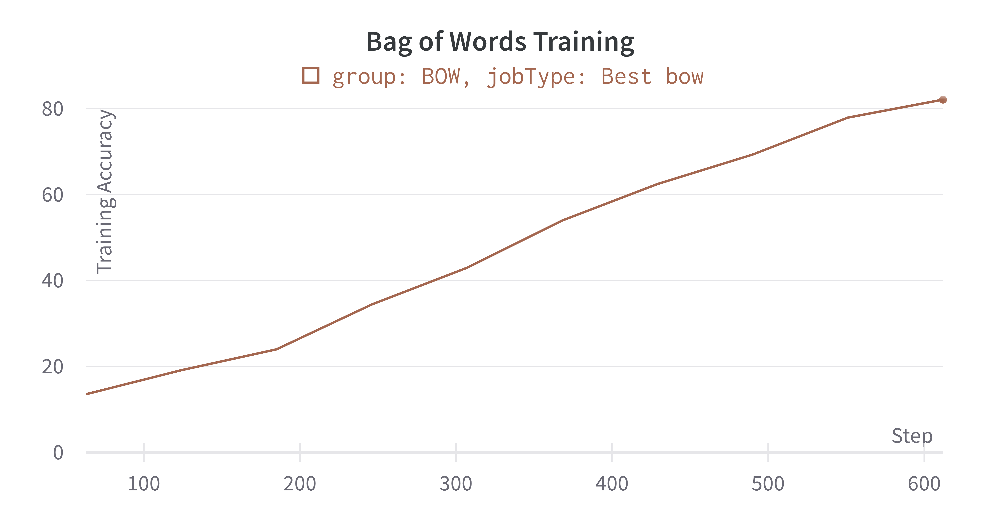

## Premise
The benefit of using the feature representations from BERT over other forms of text representation for Natural Language processing. In this experiment, I compare the features generated by the BERT Model to two popular text representation techniques used in NLP: Bag of Words and TF-IDF.
The need for text representation is motivated by the model's need for input in a vectorised form and not as plain text. 

To ensure a reasonable comparison, the classifier will recieve a comparable input from each of the methods. The feature input length is chosen as **batch_size x 512** because the BERT classifier's input size is 512.

## Bag of Words
Extracts features from text by describing the occurrence of words within the text using a vocabulary of known words and measure of the presence of known words.
However, any information about the order or structure of words in the document is discarded. Every word count is considered a feature with a focus on the presence of known words in the text, and not where.
The workflow used here is:
- Data cleaning by removing null or special character or numbers and converting the text to lowercase and removing the german stop words.
- Creation of the vocabulary. I have limited the vocabulary size by only using the 512 most common words to limit my feature input size.
- Creation of the BOW vectors, the max length is set to the first 512 representations. If the vocab word shows up in the sentence, it gets a value of 1 else 0.

Downsides:
- The accuracy is very dependent on the vocabulary created. A vocab size of 5000 is far more accurate.
- no storage of context. A word can be used in many ways in different contexts but will mean the same to the model
- vector length is variable and padding would be needed to handle 

## TF-IDF
A problem with only word counting is that common words used in multiple contexts seem more important but may not contain much information (information here would be the ability to infer the domain of the data). 
A potential solution is to rescale the word frequcny by how often it shows up in other texts.  
Term frequency part of TF-IDF is the word count, inverse document frequency is how rare the word is across the given texts. This helps create some correlation between the domain and the word in use, highlighting which words have useful information.
The idf of a rare term (potentially linked to a domain) is high, whereas the idf of a frequent term is likely to be low.

The workflow used here is:
- Data cleaning by removing null or special character or numbers and converting the text to lowercase and removing the german stop words.
- The words are vectorised, a vocabulary is created and the word counts are measured.
- A dictionary is also created to count the occurence of the words in the vocabulary in all the texts
- The word count is scaled by the inverse of the term frequency and the resulting vector is truncated to keep it at 512.

Downsides:
- context is largely ignored.
- Scaling is difficult since quality of data depends on the vocabulary and the length of the TF-IDF vector.

## Assumptions
- vocabulary size is capped at 512
- All methods recived input of the similar size overall, ~ 1600 samples of 512 vectors

## Experiment  
For each text representation type, the features are generated and fed to the classifier to train for a maximum of 10 epochs. HPO was done with BOHB on the training accuracy metric varying:
- LR
- batch
- epochs
- optimiser
Only 50 runs were possible. No seed variation. 

### Best config 

#### BoW
**Best Config**
'batch': 32,  
'epochs': 10,  
'lr': 0.004939121389077578,
'optimiser':'Adam'

#### TF-IDF
**Best Config**
'batch': 128,  
'epochs': 10,  
'lr': 0.006876174282463883,
'optimiser':'RMSprop'

###  **BOHB**

## Thoughts
- Bow, TF-IDF are easy to implement and take less time for feature extraction and training. 
- Scaling is a problem. Experiments with 7000 feature sizes were far more accurate, ~91%
- The vectors are dependent on the vocabulary and no benefit of pretraining. 
- The context and meaning of the language is not preserved. 