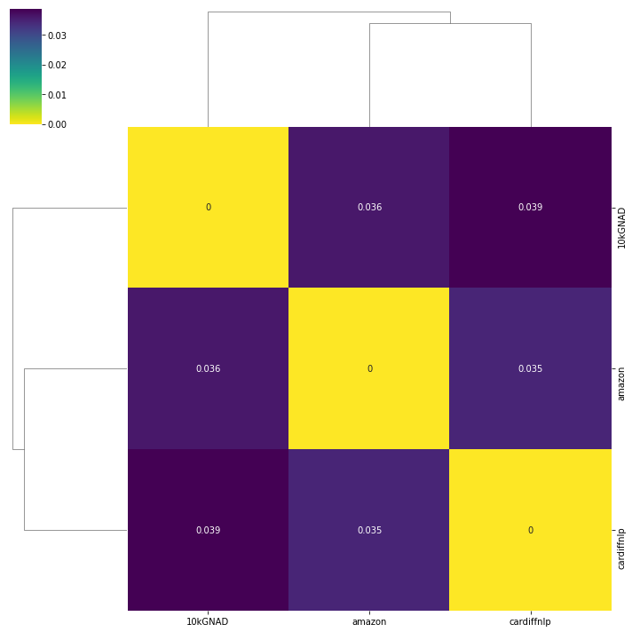

Feature Extraction from BERT takes time due to it's size. Would it be possible for a simpler method to be able to obtain embeddings similar to what Bert can?

## Premise
Acc to Paper, **the “informative content,” of a weight for the task can be quantified by considering a perturbation  δw of the weights, and measuring the divergence between the original output distribution pw(y|x) and the perturbed one pw' (y|x).**
Do the weights from a shallow model also contain this content?

## Experiment
The layers of the classifiers used for fastText etc, are used in Task2Vec and the corresponding maps are calculated.
Dataset: part of Amazon multi review validation set.
Models: FastText, TF-IDF, BoW, Bert

## Results
- The resulting embeddings do not contain much information. 
- Emebeddings very different from Bert's version. But similar to each other. 
- Model may be too simple?

FastText model trained on 3 datasets, 10kGNAD , amazon, cardiffnlp
- not sufficient distance between the datasets. (What's the threshold :/)
- model is too shallow so the abstract features are used for the FIM calculations. 

